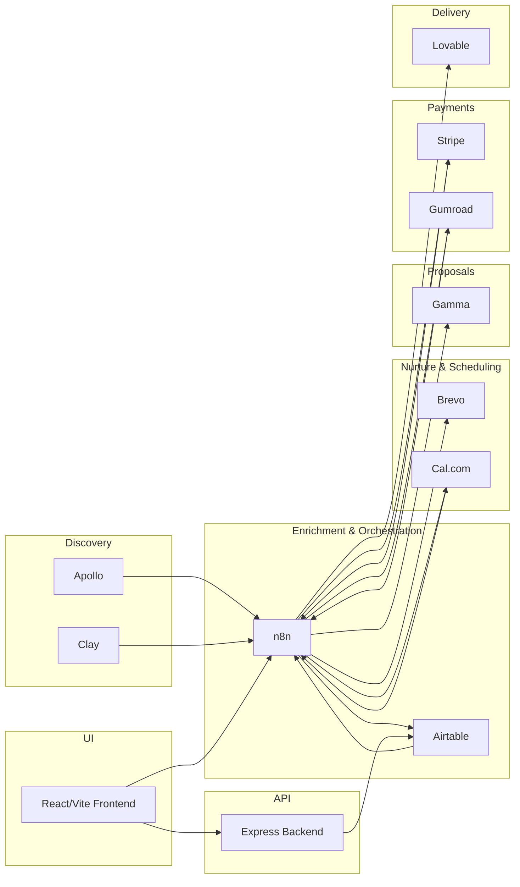

# Cervoa Agentic Sales Automation — Architecture

## Flow
1) Discovery: Apollo/Clay searched via n8n → leads scored → stored in Airtable.
2) Nurturing: n8n watches Airtable (Status=New) → Brevo add/update contact → Status=Contacted.
3) Scheduling: Cal.com bookings → n8n webhook → Airtable Meetings.
4) Proposals: Meeting notes → Gamma for draft → stored/linked in Airtable.
5) Payments: Stripe/Gumroad checkout links → webhook to n8n → Airtable Revenue.
6) Delivery: Lovable triggered post-payment → status back to Airtable.
7) UI: React dashboard reads from backend (Airtable) and can trigger n8n via backend stubs/webhooks.

## Hosting/Integration Touchpoints
- Backend: `/api/dashboard|leads|meetings|webhooks|integrations/*`, Swagger at `/api/docs`.
- Frontend: uses `VITE_API_URL` to reach backend; optionally `VITE_N8N_BASE_URL` for direct calls.
- n8n: webhook endpoints for Cal, payment, delivery; scheduled Apollo discovery; Airtable triggers.
